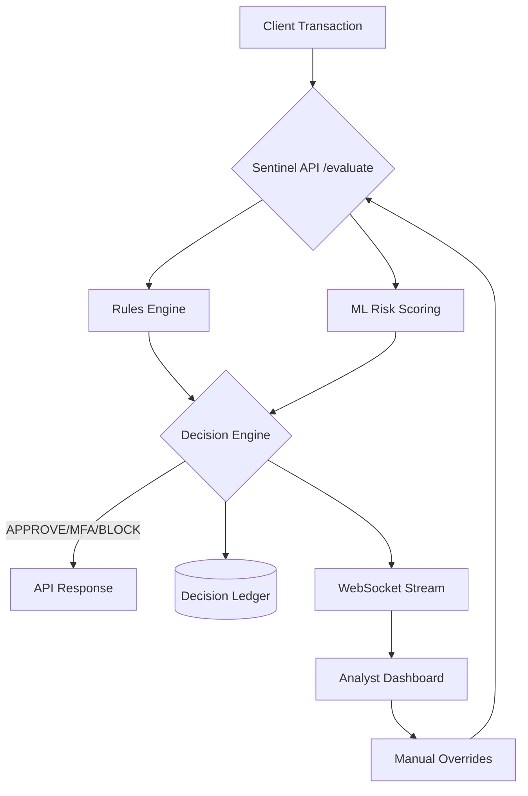

# 🛡️ Project Sentinel: Real-Time Fraud Operations Platform

[](https://sentinel-frontend.onrender.com)
[](https://opensource.org/licenses/MIT)
[](https://fastapi.tiangolo.com/)

**Sentinel** is a production-grade fraud detection and analyst operations platform designed for high-throughput financial environments. It integrates deterministic rule-based checks with advanced machine learning risk scoring to provide real-time decisioning and live monitoring.

---

## 🚀 Live Environment

The platform is fully deployed and accessible:

*   **Analyst Dashboard:** [https://sentinel-frontend.onrender.com](https://sentinel-frontend.onrender.com)
*   **Backend API:** [https://sentinel-api.onrender.com/api/v1](https://sentinel-api.onrender.com/api/v1)
*   **System Health:** [https://sentinel-api.onrender.com/api/v1/health](https://sentinel-api.onrender.com/api/v1/health)

---

## 🛠️ System Architecture

Sentinel employs a modular architecture designed for low-latency decisioning and high observability.



---

## 📦 Getting Started (Local Setup)

Follow these steps to clone and run the Sentinel platform on your local machine.

### 1. Clone the Repository
```bash
git clone https://github.com/pranay-ds/GODSEC.git
cd GODSEC
```

### 2. Backend Setup (FastAPI)
Create a virtual environment and install dependencies:
```bash
# Create venv
python -m venv .venv
source .venv/bin/activate  # Windows: .venv\Scripts\activate

# Install requirements
pip install -r requirements.txt

# Start the API service
python -m api.app
```
The API will be available at `http://localhost:8000`.

### 3. Frontend Setup (React + Vite)
Install dependencies and start the development server:
```bash
cd frontend
npm install
npm run dev
```
The dashboard will be available at `http://localhost:5173`.

### 4. Continuous Traffic Generation (Demo Mode)
To see the dashboard in action with live simulated data, run the pipeline simulator in a separate terminal:
```bash
python scripts/live_stream_simulator.py
```

---

## 📂 Repository Structure

*   `api/` - Backend service (FastAPI)
*   `frontend/` - Analyst dashboard (React/Vite)
*   `scripts/` - Operational scripts and simulators
*   `data/` - Dataset for demo and training
*   `models/` - ML model registry and logic

---

## 🛡️ Key Capabilities

*   **Real-Time Decisioning:** Sub-second latency for `APPROVE`, `MFA`, or `BLOCK` verdicts.
*   **Hybrid Intelligence:** Combines deterministic safety rules with probabilistic ML scoring.
*   **Analyst Control Center:** Live-streaming dashboard with KPI tracking and one-click manual overrides.
*   **Explainable Fraud (XAI):** Built-in support for SHAP-based feature importance on high-risk detections.
*   **Resilient Infrastructure:** Graceful fallback mechanisms for degraded network or backend conditions.

---

## 🧪 Tech Stack

| Layer | Technologies |
| :--- | :--- |
| **Backend** | Python, FastAPI, Pydantic, NumPy |
| **ML Engine** | Scikit-learn, XGBoost, SHAP |
| **Frontend** | React 19, Vite, Tailwind CSS, Recharts |
| **Persistence** | SQLite (Ledger), Redis (Optional Cache) |
| **Deployment** | Render (CI/CD), Docker Compose |

---

## 👤 Author

**Pranay DS**
*   GitHub: [@pranay-ds](https://github.com/pranay-ds)
*   Repository: [GODSEC](https://github.com/pranay-ds/GODSEC)

---

> [!NOTE]
> Sentinel is architected for scalability. While the demo environment uses SQLite for ease of deployment, the system is fully compatible with Kafka for event streaming and Neo4j for fraud ring visualization.
